<!-- Cover -->
<p align="center">
    
    <a href="https://github.com/thanhENC/e2e-data-platform" target="_blank">
        
    <a href="https://linkedin.com/in/van-an-dinh" target="_blank">
        
    </a>
    <a href="https://medium.com" target="_blank">
        
    </a>
    <a href="https://www.youtube.com/@thanhenc?sub_confirmation=1
    " target="_blank">
        
    </a>
</p>

<!-- Author -->
# Author
<table style="background-color:rgba(255, 255, 255, 0.8); border-radius:10px; border: 2px solid #000; overflow:hidden; color:#333;">
  <tr>
    <td>
      
    </td>
    <td>
      <p>I'm <strong>Van-An Dinh</strong>, but I prefer to be called <strong>Thanh</strong>.</p>
      <p>I’m always excited to connect with like-minded individuals and professionals in the data community. Feel free to reach out or follow my work on the following platforms:</p>
      <p>
        <a href="https://github.com/thanhENC" target="_blank">
          
        </a>
        <a href="https://linkedin.com/in/van-an-dinh" target="_blank">
          
        </a>
        <a href="https://www.youtube.com/@thanhenc?sub_confirmation=1" target="_blank">
          
        </a>
      </p>
    </td>
  </tr>
</table>

# Project
<p align="center">
    
</p>
<strong>PoC Data Platform</strong> is an innovative project designed to demonstrate how data from AdventureWorks can be extracted, loaded, and transformed within a data lake environment. Leveraging a suite of modern data tools and technologies, the platform serves as a comprehensive showcase and a practical template for individuals interested in data engineering, data system design, or simply exploring the data world. Whether you're a professional or just beginning to learn about data systems, this project offers a clear reference point to deepen your understanding of the modern data stack.
</br> </br>
Below is a Docker map that provides a visual overview of the interrelationships between all services integrated within the platform.
<p align="center">
    
    Docker map (Source: Author)
</p>

## I. Quick start

> Before installing these data services, make sure your machine meets the following minimum system requirements:
>
> - CPU >= 4 Core
> - RAM >= 8GB

### Services distribution
Due to the limitations in computing resources, I have decided to distribute data services based on their resource consumption rate and the interrelationships among all services, rather than consolidating evething on a single server 🔥

For this project, I chose to rent VPS from <a href="https://www.digitalocean.com"></a>. It’s an excellent option for running side projects beside other providers like , ,  

<table style="width: 100%;">
  <tr align="center">
    <th>Service</th>
    <th>Doc</th>
    <th>Server-01</th>
    <th>Server-02</th>
    <th>Server-03</th>
  </tr>
  <tr align="center">
    <td></td>
    <td></td>
    <th colspan="3">Ubuntu 24.04 (LTS) x64 | 4 cores - 8 GB</th>
  </tr>
  <tr align="center">
    <td>Airflow</td>
    <td><a href="airflow/README.md"></a></td>
    <td>✅</td>
    <td>❌</td>
    <td>❌</td>
  </tr>
  <tr align="center">
    <td>Spark</td>
    <td><a href="docker/spark/README.md"></a></td>
    <td>❌</td>
    <td>✅</td>
    <td>❌</td>
  </tr>
  <tr align="center">
    <td>Minio</td>
    <td><a href="docker/minio/README.md"></a></td>
    <td>❌</td>
    <td>❌</td>
    <td>✅</td>
  </tr>
  <tr align="center">
    <td>Hive metastore</td>
    <td><a href="docker/hive-metastore/README.md"></a></td>
    <td>❌</td>
    <td>❌</td>
    <td>✅</td>
  </tr>
  <tr align="center">
    <td>Trino</td>
    <td><a href="docker/trino/README.md"></a></td>
    <td>❌</td>
    <td>❌</td>
    <td>✅</td>
  </tr>
  <tr>
  <tr align="center">
    <td>DBT</td>
    <td><a href="dbt/README.md"></a></td>
    <td>❌</td>
    <td>❌</td>
    <td>✅</td>
  <tr align="center">
    <td>Lightdash</td>
    <td><a href="docker/lightdash/README.md"></a></td>
    <td>❌</td>
    <td>❌</td>
    <td>✅</td>
  </tr>
  <tr align="center">
    <td>Nginx</td>
    <td><a href="docker/nginx/README.md"></a></td>
    <td>-</td>
    <td>-</td>
    <td>✅</td>
  </tr>
  <tr align="center">
    <td>Certbot</td>
    <td><a href="docker/certbot/README.md"></a></td>
    <td>-</td>
    <td>-</td>
    <td>✅</td>
  </tr>
</table>

⚠️ Something I want to inform you
- Lightdash only accepts secure connections from Trino using username-password; connections without authentication are not permitted
- Trino must be hosted under SSL/TLS to utilize username and password authentication
- There are several methods to add SSL/TLS to Trino. For this project, I used a certificate from Certbot (Let’s Encrypt). Alternatively, you can implement SSL/TLS by setting up a proxy through Cloudflare 🫡

### Domain name
In this project, we need a domain name for several important reasons, particularly to enable SSL/TLS certificates for secure user-password authentication in Trino.

<table>
  <tr>
    <td>
      
    </td>
    <td>
      One great option for a <strong>free domain name</strong> is <strong>DuckDNS</strong> 🦆, which allows you to point a domain to your server easily
    </br> </br>
    <a href="docker/certbot/README.md"></a>
  </td>
  </tr>
</table>

🤑 Alternatively, you can purchase a domain from providers like Name.com, Namecheap, or GoDaddy.

Beyond securing Trino, having a domain offers additional benefits. It simplifies access to other services, like Airflow Webserver, Lightdash, DBT documentation, and Spark UI, allowing you to use a recognizable domain instead of the less convenient <ip>:<port> format for accessing these services 🙂‍↕️

### SSL/TLS
Two solutions you can try to implement SSL/TLS

|  | Solution 1 | Solution 2 |
| --- | --- | --- |
| Participants | `Cloudflare` & `Your own domain name` | `Certbot` & `DuckDNS domain name` |
| Description | Add `Cloudflare` proxy to your DNS and enable secure connection options to implement SSL/TLS | Obtain a certificate from a Certificate Authority (CA) and integrate it with your proxy server (e.g., `Nginx`) |

If you already have SSL/TLS from domain name provider when you purchased it, feel free to skip this section.

### Starting all services
Before running the installation command, make sure that [Docker](https://docs.docker.com/get-docker/) and [Docker Compose](https://docs.docker.com/compose/install/) are installed on your machine. To start data services in this project, let’s jump to the `docker` directory and run command in `Makefile` or docker command if you require more customization.

```shell
Usage: make [target]

Targets:
  create-network                Create docker network if not exists
  compose-up-all                Compose up with all services
  compose-up-spark1             Compose up with 1 spark worker
  compose-up-spark2             Compose up with 2 spark workers
  compose-up-spark3             Compose up with 3 spark workers
  compose-up-certbot            Compose up with certbot
  compose-up-trino              Compose up with 1 trino workers
  compose-down                  Compose down all services then remove network
  get-cert                      Get certbot certificate
  spark-submit                  Spark master submit
  backup                        Backup OLTP, Minio and Hive metastore data
  init-db                       Initialize adventureworks database
  clean                         Clean temp data
  clean-all                     Clean all
  help                          Show this help message
```
<p align="center">
  <a href="docker/Makefile">Makefile</a> (Source: Author)
</p>

For example, starting all services

```shell
cd docker
cp .env.example .env
make compose-up-all
```

If you can't use `Makefile`, you can run the following command

```shell
cd docker
cp .env.example .env
docker network inspect data-network > /dev/null 2>&1 || docker network create --driver bridge data-network
docker compose --profile spark --profile trino --env-file .env up -d
```

⚠️ If you need to customize the configuration, please refer to the comments in our [.env.example](docker/.env.example) file and update the corresponding values in your `.env` file. Additionally, you might need to make adjustments to the [docker-compose.yaml](docker/docker-compose.yaml) file itself, such as changing `image versions`, `service profiles`, `port mappings`, or `volume mounts`, based on your specific deployment environment and requirements. After making any changes, please re-run `make compose-up-all`

## II. Components/Services
📂 **Project structure**
```shell
.
├── adw14/                /* AdventureWorks data folder */
├── airflow/              /* Airflow folder contains DAGs, configurations and docker */
├── assets/               /* Contains various project assets like pdf, images, etc. */
├── dbt/                  /* DBT project folder contains project files and docker */
├── docker/               /* Docker configurations and related files of data product */
│   ├── backup/               /* Backup files for databases or components */
│   ├── certbot/              /* Certbot folder for managing SSL certificates */
│   ├── lightdash/            /* Lightdash folder for business intelligence tools */
│   ├── minio/                /* MinIO for object storage (S3-compatible) */
│   ├── nginx/                /* Nginx web server and reverse proxy configurations */
│   ├── spark/                /* Apache Spark cluster configurations */
│   ├── trino/                /* Trino cluster configurations */
│   ├── volumes/              /* Docker volumes for persistent data storage */
│   ├── .env.example          /* Template of environment variables file */
│   ├── docker-compose.yaml   /* Docker Compose file to define data product services */
│   ├── Makefile              /* Makefile for automating tasks and commands */
├── .gitignore
├── Author.md
├── LICENSE
├── README.md
└── References.md
```

### 2.1. Adventureworks OLTP
<p align="center">
  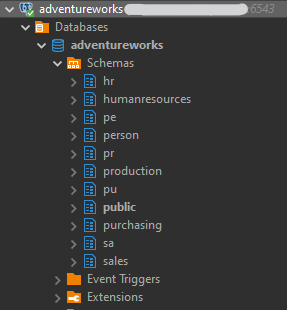
  </br>
  Adventureworks data (Source: Author)
</p>

[Adventureworks](https://learn.microsoft.com/en-us/sql/samples/adventureworks-install-configure?view=sql-server-ver16&tabs=ssms) is utilized as the OLTP database for our project. As a comprehensive operational database published by Microsoft, Adventureworks covers a wide range of domains. For full visibility into its data schema, you can reference [Dataedo](https://dataedo.com/samples/html/AdventureWorks/doc/AdventureWorks_2/home.html). To align with the requirements of our data platform, we have migrated this database to PostgreSQL, simulating a real-world database environment that acts as the primary data source for our data lake.

> How to initialize AdventureWorks data

After launching the OLTP service (PostgreSQL) in the data platform, you can import data into the database by running the following command
```shell
cd docker
make init-db
```

Or you can run the bash file directly in the `adw14` folder
```shell
cd adw14
chmod +x adw14data.sh
adw14data.sh
```
### 2.2. Apache Airflow
<p align="center">
  
  </br>
  Apache Airflow overview (Source: Author)
</p>

Apache Airflow serves as data platform orchestrator, which manages and schedules all data pipelines.

<p align="center">
  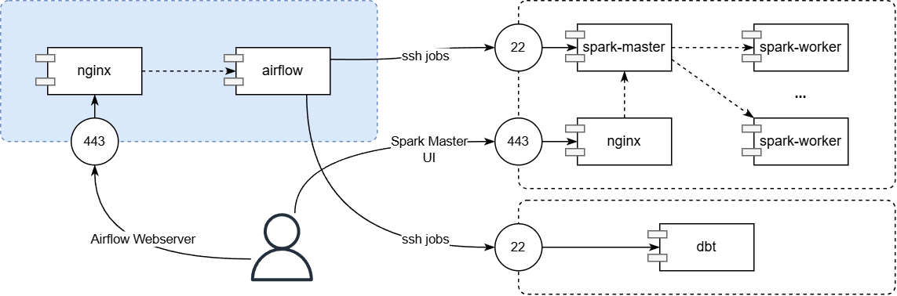
  </br>
  Airflow Docker map (Source: Author)
</p>

You can start Airflow by running this following command
```shell
cd airflow
make compose-init
# if it's the first time you run airflow, or you want to rebuild airflow image

# or
# make compose-up
```
In this project, I created 2 connections in Airflow. Make sure you also create required connections before running the DAGs
<p align="center">
  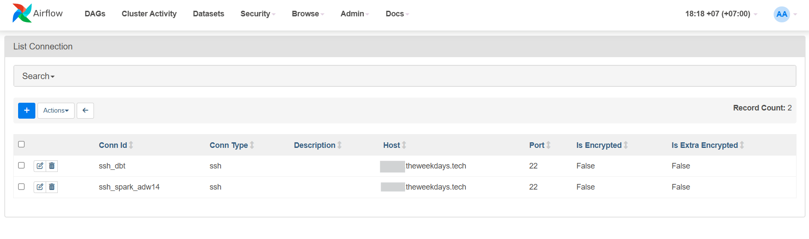
  </br>
  Airflow connections (Source: Author)
</p>

### 2.3. Apache Spark
<p align="center">
  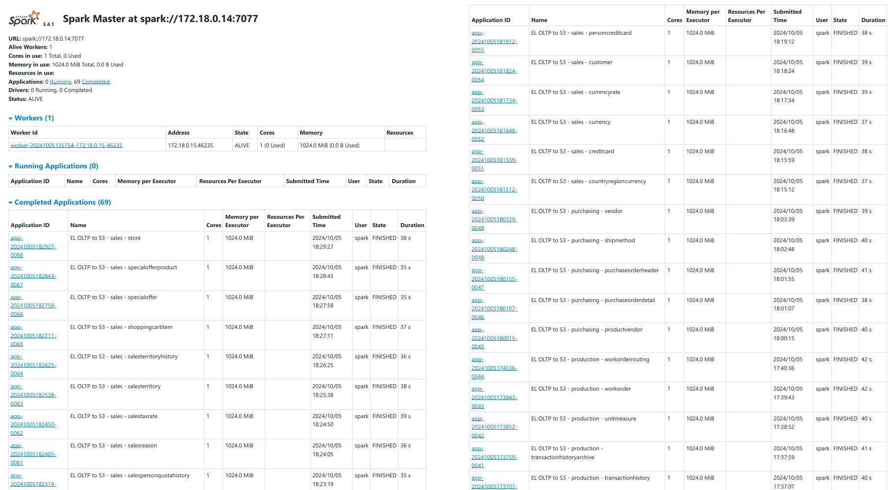
  </br>
  Apache Spark overview (Source: Author)
</p>

Apache Spark acts as the data processing engine responsible for extracting and loading data from the OLTP source to the bronze layer in the data lake. Spark’s power lies in its versatility, handling not only data engineering tasks but also data science and machine learning workloads, whether on single-node machines or distributed clusters. However, for the purposes of this showcase, Spark is used in a minimal capacity to allow other tools in the data stack to take center stage 😜

<p align="center">
  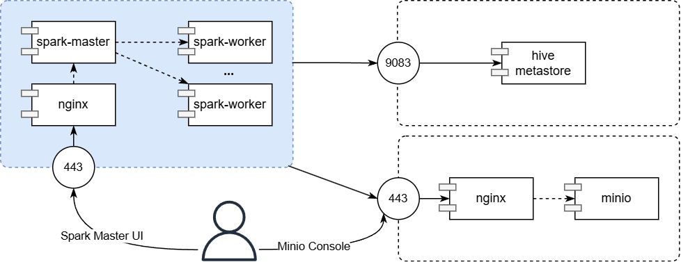
  </br>
  Spark Docker map (Source: Author)
</p>

In this project, I initialized the Spark cluster with 01 master node and 01 worker node. You can easily scale the number of worker nodes by specifying the `--scale spark-worker=N` parameter, where `N` represents the desired number of worker nodes
```shell
cd docker
make compose-up-spark1 #To init 01 worker node
# make compose-up-spark2 #To init 02 worker nodes

# or you can run this command without Make to init 02 worker nodes
docker compose --profile spark --scale spark-worker=2 up -d
```
⚠️You can check and adjust my Makefile in `docker` folder to have more management commands

### 2.4. MinIO
<p align="center">
  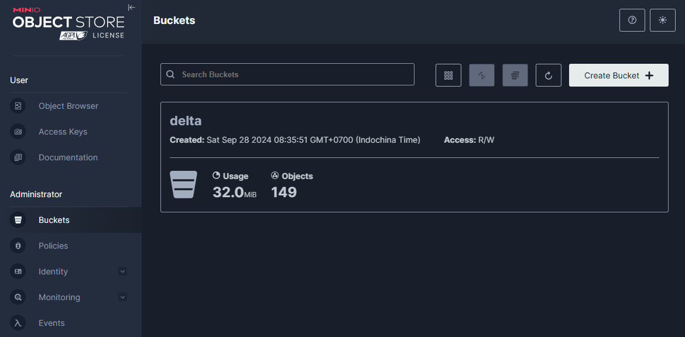
  </br>
  MinIO overview (Source: Author)
</p>
MinIO serves as the storage layer in the data lake, housing both raw and transformed data. Apache Spark, Hive Metastore, and Trino interact directly with MinIO for various data operations. For a clearer understanding of how these services are connected, you can refer to the overview Docker map, Spark Docker map, and Trino Docker map, which illustrate the relationships between these components.

### 2.5. Hive Metastore
😅 Ops, I don’t know which images about Hive-metastore should be added to this article. We will dive into the docker map to know more about the relationship between Hive-metastore and other services 🫡

### 2.6. Trino
<p align="center">
  
  </br>
  Trino overview (Source: Author)
</p>

Trino functions as a query engine that can access and query data from multiple sources while performing transformations within its cluster. In our setup, we utilized Trino as a data warehouse, where DBT orchestrates the transformation jobs by triggering the execution directly within Trino.

<p align="center">
  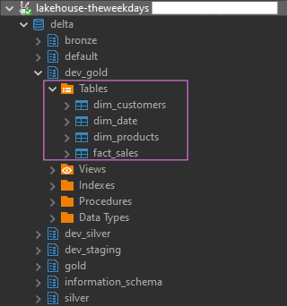
  </br>
  Delta catalog in Trino after transforming data (Source: Author)
</p>

<p align="center">
  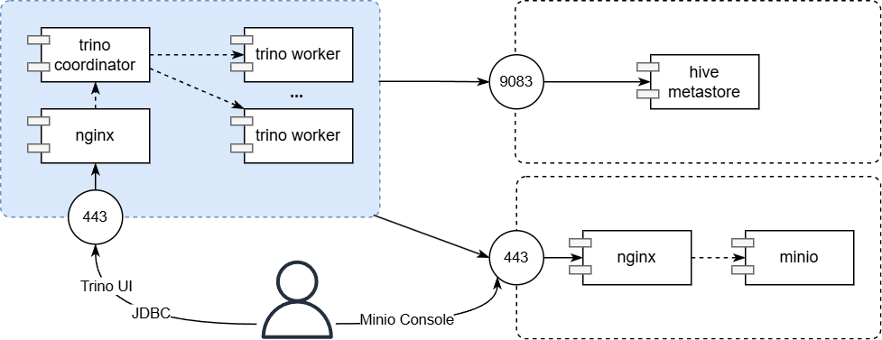
  </br>
  Trino Docker map (Source: Author)
</p>

### 2.7. DBT
<p align="center">
  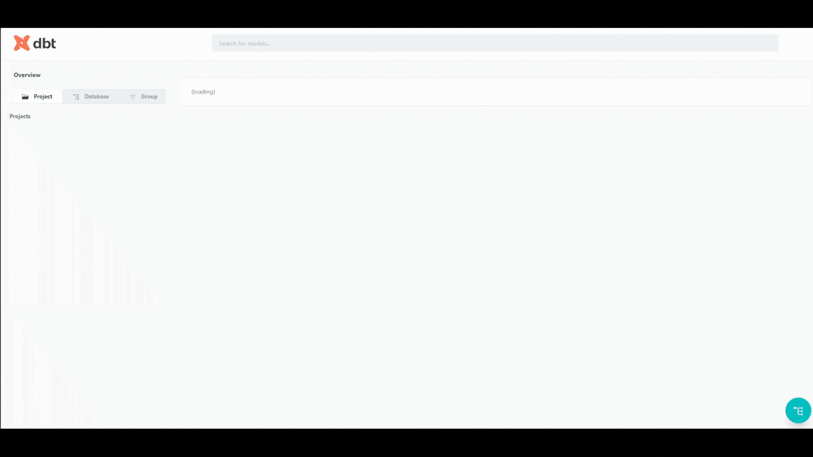
  </br>
  DBT overview (Source: Author)
</p>
DBT acts as an essential layer in our data transformation process, facilitating the process of moving data from the bronze layer to the data mart. Within the DBT project, schema information, field definitions, data quality checks, and data lineage are managed in a centralized location. Additionally, DBT documents can be hosted as a site, providing easy access to data mart’s metadata.

</br>
<p align="center">
  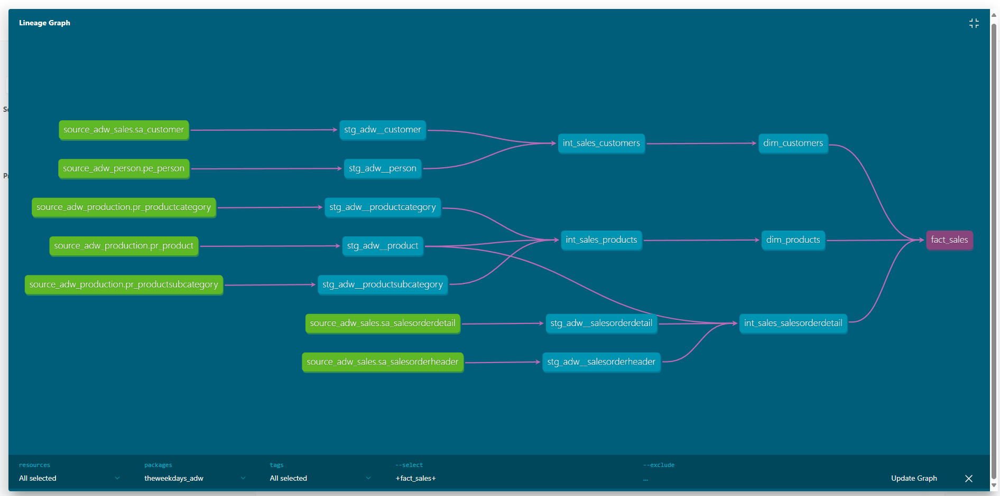
  </br>
  Fact sales lineage (Source: Author)
</p>

<p align="center">
  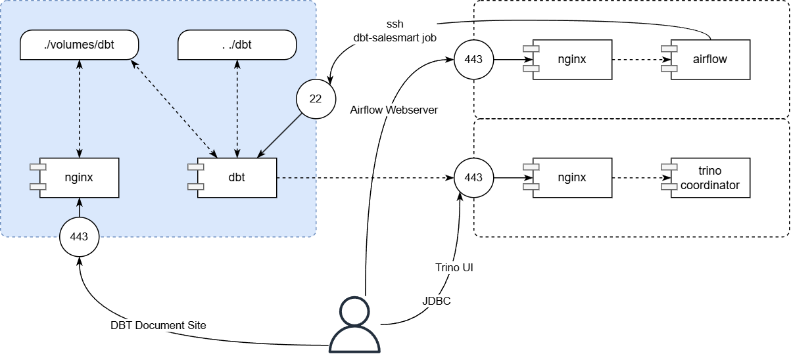
  </br>
  DBT Docker map (Source: Author)
</p>

We can use DBT with 02 options:

- Cloud: [dbt Cloud | dbt Labs (getdbt.com)](https://www.getdbt.com/product/dbt-cloud)
- DBT-core: https://github.com/dbt-labs/dbt-core

**Data model**: In this project, I created a simple data model with `3` dimensions. You can expand the model by adding more dimensions and metrics to the fact table, which would be a great way to enhance data analysis skills.

✌🏻 With dim customers, you can have more insightful information from XML data in the Person schema. But I’m too lazy to do it now 😜 give this chance to you 🫵🏻

<p align="center">
  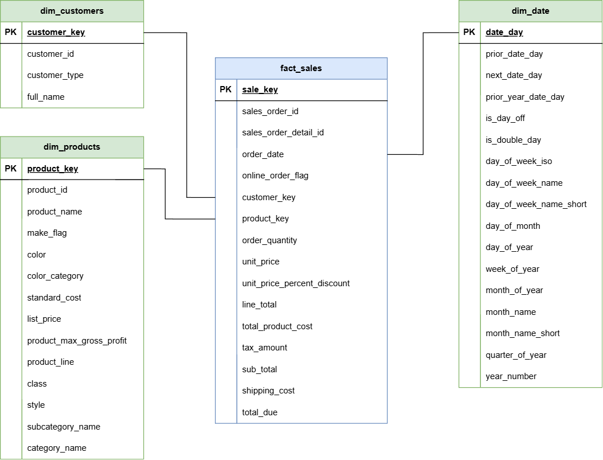
  </br>
  Sales mart data model (Source: Author)
</p>

### 2.8. Lightdash
<p align="center">
  
  </br>
  Lightdash overview (Source: Author)
</p>

Lightdash is used as BI tool in this project. The reason why I chose it is Lightdash is a perfect match with DBT and it’s opensource which we can use for self-hosting. 

> Daily delivery sales dashboard to stakeholders via email

<p align="center">
  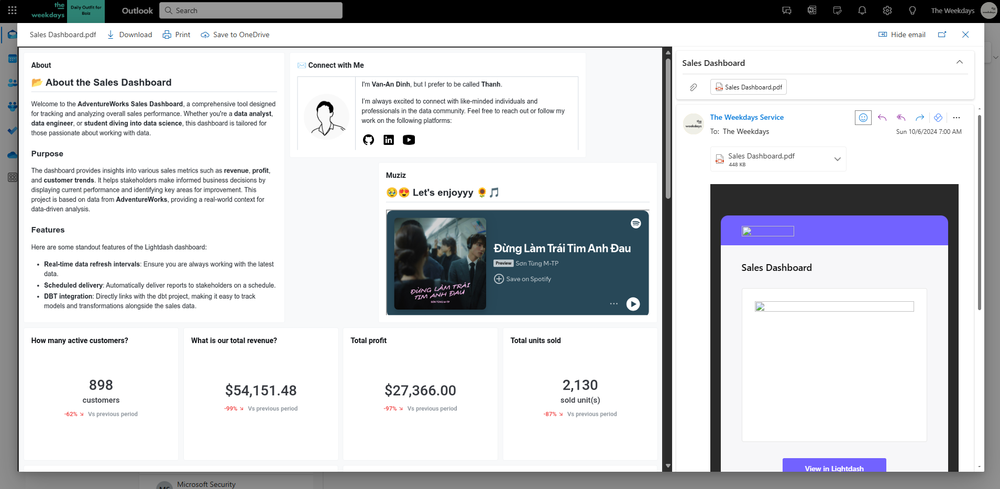
  </br>
  Lightdash daily delivery email (Source: Author)
</p>

Stakeholders can download the [`pdf file of the sales dashboard`](assets/pdf/lightdash-sales-dashboard.pdf) or directly access Lightdash to view the interactive version.

<p align="center">
  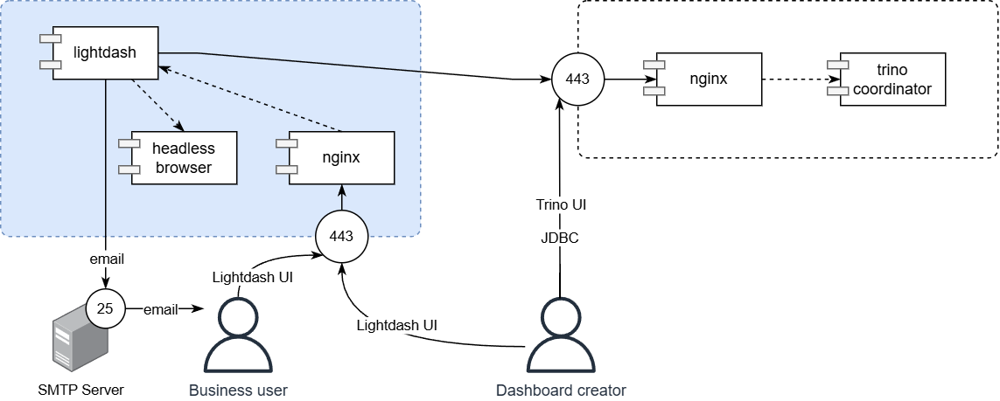
  </br>
  Lightdash Docker map (Source: Author)
</p>

We can use Lightdash with 02 options

- Cloud: [Lightdash | Self-serve BI to 10x your data team](https://www.lightdash.com/)
- Self-host: [Self-Host Lightdash | Documentation | Lightdash](https://docs.lightdash.com/self-host/self-host-lightdash/)

### 2.9 And some other services
As seen in the Docker setup, I’ve included several essential services such as Nginx, Certbot and metadata database for data services. These components serve as the foundational building blocks of our data platform, ensuring the smooth operation of the project.

However, these services can be replaced by equivalent cloud solutions if needed
| Service | Replaced solutions |
| --- | --- |
| Metadata database (Airflow, Lightdash, Hive metastore, OLTP) | [Neon Serverless Postgres](https://neon.tech/), [Supabase](https://supabase.com/) |
| Minio | Amazon S3, Cloudflare R2, DigitalOcean Spaces Object Storage |

# Supervisors and Supporters
<table>
  <tr>
    <td>
      I came up with the idea for this side project after a meeting with my sister, <a href="https://www.linkedin.com/in/trangtth179/">Ms. Trang</a> (MSc Business Informatics at the University of Mannheim, Germany). I would like to express my heartfelt gratitude to Ms. Trang for her inspiration and encouragement throughout my journey.
  </td>
    <td>
      
    </td>
  </tr>
</table>

Thank [@NhatNguyen](https://www.linkedin.com/in/trannhatnguyen2604/)‘s [work](https://github.com/trannhatnguyen2/NYC_Taxi_Data_Pipeline) and [Dify](https://github.com/langgenius/dify) for the main references about project components and structures.

Thank [@BaoTram](https://www.linkedin.com/in/baotram237/) for giving me foundational knowledge about DBT to apply to this project.

And a big thanks to all the authors of articles, blogs, and videos I’ve watched to finish this project. You can find them in [References list](References.md) here.

# Staying ahead

Star the project on GitHub and be instantly notified of new releases.


## Contributing

For those who'd like to contribute code, see our [Contribution Guide]().
At the same time, please consider supporting me by sharing it on social media and at events and conferences.

**Contributors**

<a href="https://github.com/thanhENC/e2e-data-platform/graphs/contributors">
  
</a>

## Community & contact

- [Github Discussion](https://github.com/thanhENC/e2e-data-platform/discussions). Best for: sharing feedback and asking questions.
- [GitHub Issues](https://github.com/thanhENC/e2e-data-platform/issues). Best for: bugs you encounter using this project, and feature proposals.
- [LinkedIn Post](https://linkedin.com/in/van-an-dinh). Best for: sharing your applications and hanging out with the community.

## Star history

[](https://star-history.com/#thanhENC/e2e-data-platform&Date)

## License

This repository is available under the [ThanhENC Open Source License](LICENSE), which is essentially MIT.
