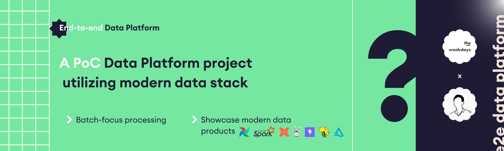
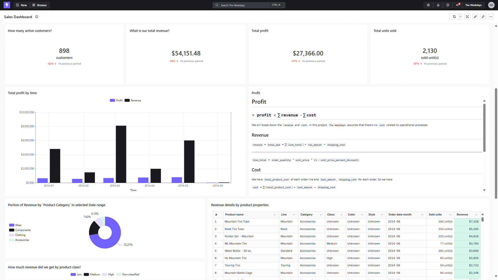
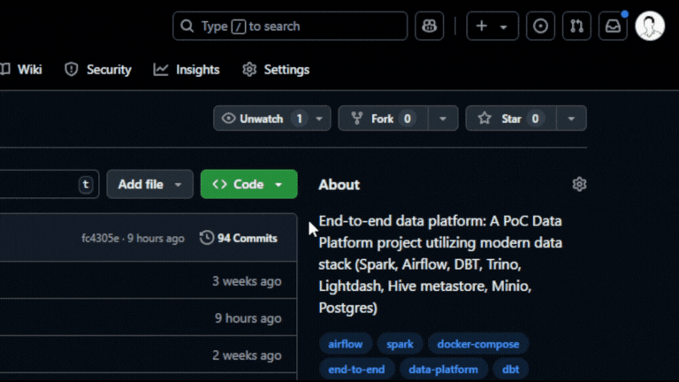

# PoC Data Platform - The Weekdays



<p align="center">
    <a href="https://github.com/thanhENC/e2e-data-platform" target="_blank">
        
    <a href="https://linkedin.com/in/van-an-dinh" target="_blank">
        
    </a>
    <a href="https://medium.com" target="_blank">
        
    </a>
</p>

Project overview: ... (updating)

## Author
<table style="background-color:rgba(255, 255, 255, 0.8); border-radius:10px; border: 2px solid #000; overflow:hidden; color:#333;">
  <tr>
    <td>
      
    </td>
    <td>
      <p>I'm <strong>Van-An Dinh</strong>, but I prefer to be called <strong>Thanh</strong>.</p>
      <p>I’m always excited to connect with like-minded individuals and professionals in the data community. Feel free to reach out or follow my work on the following platforms:</p>
      <p>
        <a href="https://github.com/thanhENC" target="_blank">
          
        </a>
        <a href="https://linkedin.com/in/van-an-dinh" target="_blank">
          
        </a>
        <a href="https://youtube.com/@thanhenc" target="_blank">
          
        </a>
      </p>
    </td>
  </tr>
</table>

<p align="center">
  <a href="./README.md"></a>
</p>

Project overview. Here's a list of the core features:
</br> </br>

**1. Feature 1**:
Feature 1 description.

**2. Feature 2**:
Feature 2 description.


## Services distribution

<table style="width: 100%;">
  <tr>
    <th align="center">Service</th>
    <th align="center">Doc</th>
    <th align="center">Server-01</th>
    <th align="center">Server-02</th>
    <th align="center">Server-03</th>
  </tr>
  <tr>
    <td align="center">Airflow</td>
    <td align="center">...</td>
    <td align="center">✅</td>
    <td align="center">✅</td>
    <td align="center">✅</td>
  </tr>
  <tr>
    <td align="center">Spark</td>
    <td align="center">...</td>
    <td align="center">✅</td>
    <td align="center">❌</td>
    <td align="center">✅</td>
  </tr>
  <tr>
    <td align="center">Trino</td>
    <td align="center">...</td>
    <td align="center">❌</td>
    <td align="center">✅</td>
    <td align="center">❌</td>
  </tr>
  <tr>
    <td align="center">Minio</td>
    <td align="center">...</td>
    <td align="center">✅</td>
    <td align="center">❌</td>
    <td align="center">❌</td>
  </tr>
  <tr>
    <td align="center">Lightdash</td>
    <td align="center">...</td>
    <td align="center">❌</td>
    <td align="center">✅</td>
    <td align="center">❌</td>
  </tr>
  <tr>
    <td align="center">DBT</td>
    <td align="center">...</td>
    <td align="center">✅</td>
    <td align="center">✅</td>
    <td align="center">❌</td>
  </tr>
  <tr>
    <td align="center">Minio</td>
    <td align="center">...</td>
    <td align="center">❌</td>
    <td align="center">✅</td>
    <td align="center">❌</td>
  </tr>
</table>

## Using Lightdash



- **Cloud </br>**
  

- **Self-hosting Lightdash </br>**
  

## Staying ahead

Star the project on GitHub and be instantly notified of new releases.



## Quick start

> Before installing these data services, make sure your machine meets the following minimum system requirements:
>
> - CPU >= 4 Core
> - RAM >= 8GB

</br>

The easiest way to start the E2e-data-platform services is to run [docker-compose.yml](docker/docker-compose.yaml) file. Before running the installation command, make sure that [Docker](https://docs.docker.com/get-docker/) and [Docker Compose](https://docs.docker.com/compose/install/) are installed on your machine:

```bash
cd docker
cp .env.example .env
docker compose up -d
```

After running, you can access the all services in your browser and start the initialization process.

> If you'd like to contribute to project or do additional development, refer to our [guide to deploying from source code]()

## Next steps

If you need to customize the configuration, please refer to the comments in our [.env.example](docker/.env.example) file and update the corresponding values in your `.env` file. Additionally, you might need to make adjustments to the `docker-compose.yaml` file itself, such as changing image versions, port mappings, or volume mounts, based on your specific deployment environment and requirements. After making any changes, please re-run `docker-compose up -d`. You can find the full list of available environment variables [here]().

## Contributing

For those who'd like to contribute code, see our [Contribution Guide]().
At the same time, please consider supporting me by sharing it on social media and at events and conferences.

**Contributors**

<a href="https://github.com/thanhENC/e2e-data-platform/graphs/contributors">
  
</a>

## Community & contact

- [Github Discussion](https://github.com/thanhENC/e2e-data-platform/discussions). Best for: sharing feedback and asking questions.
- [GitHub Issues](https://github.com/thanhENC/e2e-data-platform/issues). Best for: bugs you encounter using this project, and feature proposals.
- [LinkedIn](https://linkedin.com/in/van-an-dinh). Best for: sharing your applications and hanging out with the community.

## Star history

[](https://star-history.com/#thanhENC/m-commerce-hk5&Date)

## License

This repository is available under the [ThanhENC Open Source License](LICENSE), which is essentially MIT.
